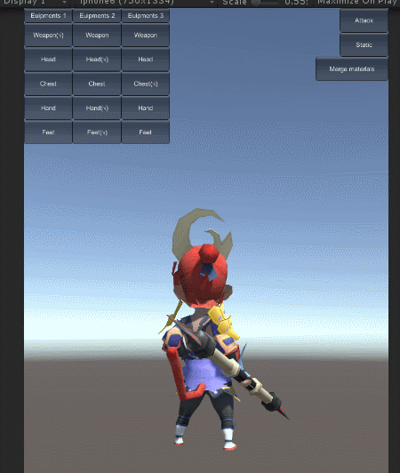
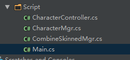
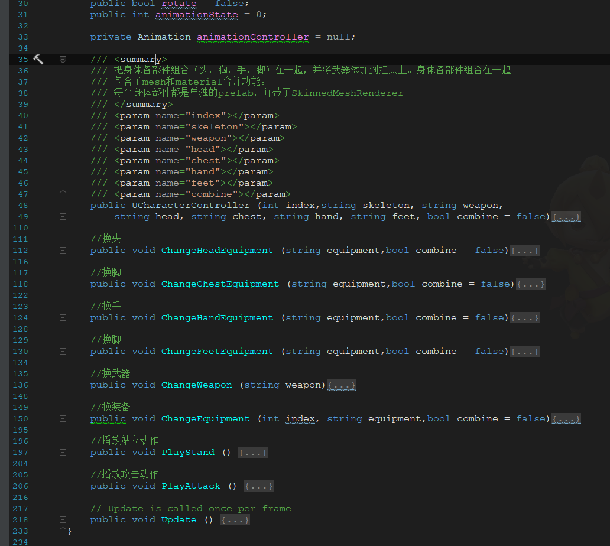
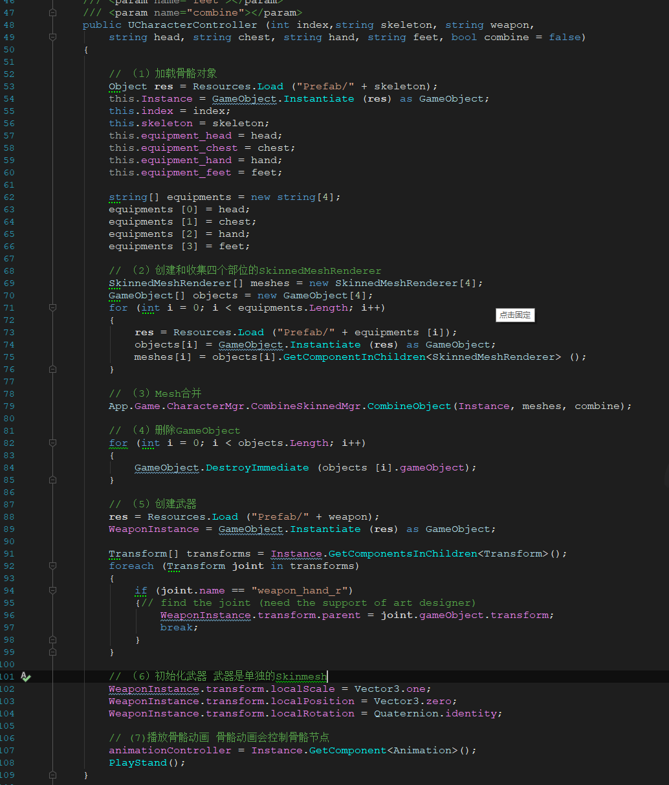
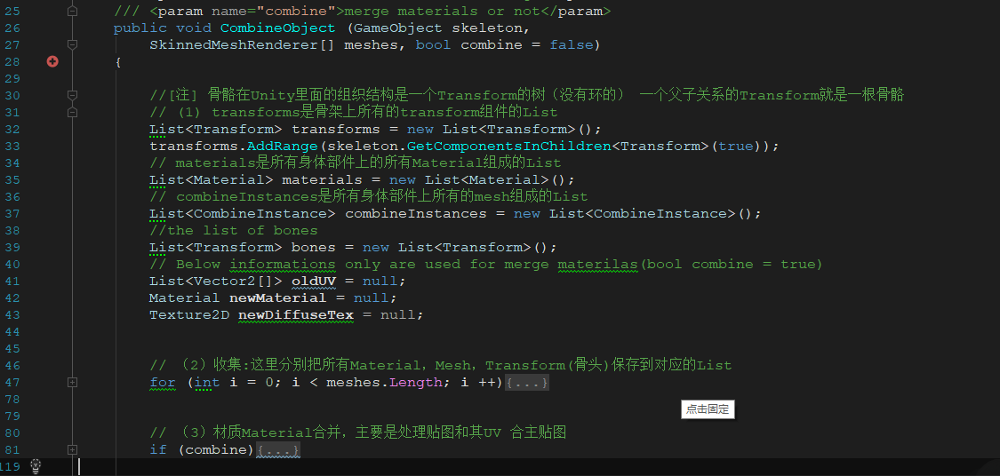
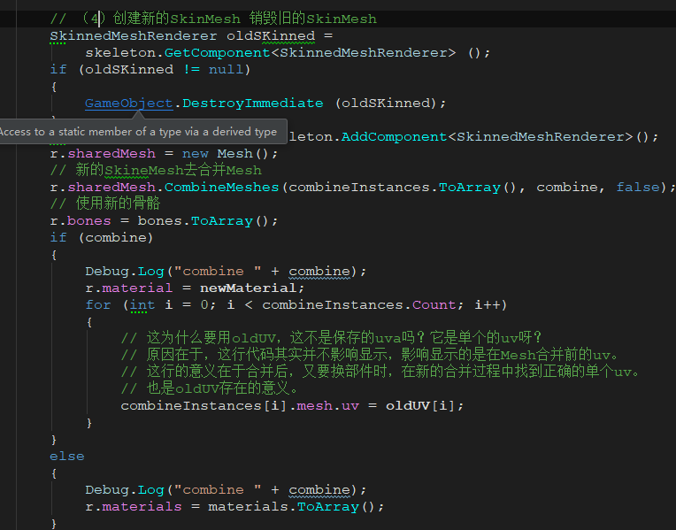

## 一、动画分类：骨骼动画 关节动画 关键帧动画
关键帧：存储关键帧数值 其他插值得到。计算量少 表现被限制 内存大
关节动画：多个Mesh  现在是多个Mesh
骨骼动画：Bone和Mesh 多层父子关系。 有骨骼层次数据  网络Mesh数据  网络蒙皮数据 

<!-- more -->

## 二、骨骼动画分析
1、骨骼数量通常有个限制 30
2、盆骨作为根骨骼
3、两个脚之间的中点作为原点

## 三、看一个换肤 demo
代码github:https://github.com/zouchunyi/UnityAvater
有个注释的github:https://github.com/GITHUB243884919/ChangeEQForUnity

博客：https://blog.uwa4d.com/archives/avartar.html

### 1、大致看下这个Demo 换武器 换衣服 换头饰

### 2、代码分析

#### 2.1 Main.cs
Main.cs就是UI交互代码 
#### 2.2 CharacterController
先把各个部分组合到一起 然后可以换头、播放动作等操作

看下这个构造函数：UCharacterController

#### 2.3 CombineSkinnedMgr核心代码
传入了骨骼 和 每个部件的SkinnedMeshRenderer

这里的纹理合并不是最优的 在mono C++ 显存都有占用 而且纹理格式是RGBA 不是压缩格式

